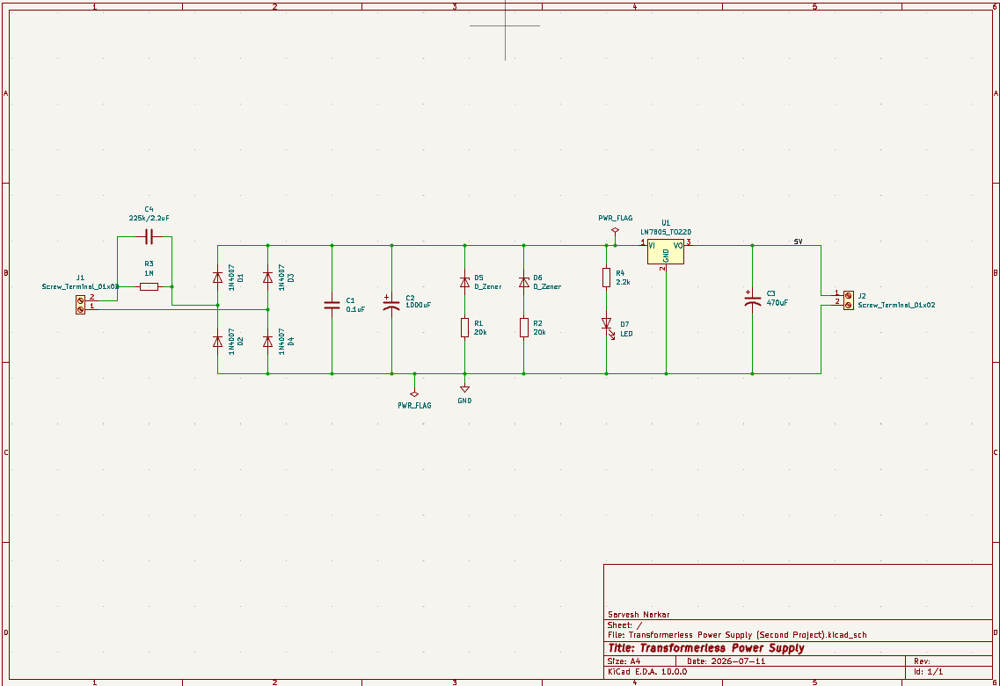

# Transformerless Power Supply

A KiCad project for a transformerless power supply design.

## Project Details

- **Designer:** Sarvesh Narkar
- **Date:** 2026-07-11
- **KiCad Version:** 10.0

## Project Structure

```
├── Transformerless Power Supply.kicad_sch    # Schematic
├── Transformerless Power Supply.kicad_pcb    # PCB Layout
├── Transformerless Power Supply.kicad_pro    # Project File
├── Schematic.png                             # Schematic Image
├── PCB Editor view.png                       # PCB View
├── 3D View.png                               # 3D Render
└── README.md                                 # This file
```

## Images

### Schematic


### PCB Layout


### 3D View


## License

This project is for educational purposes.
